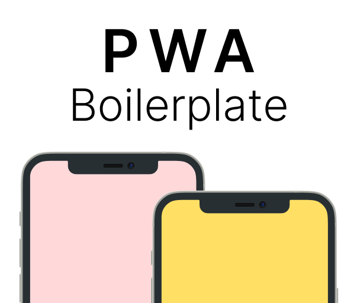

    

    
    
    

## What is Easter Journey?

Easter Journey is React & NextJS based boilerplate written in TypeScript.
It's designed to help you kick-start your next project by supplying you with features & components to cut development time.

## What features does Easter Journey bring?

The following are features that come with Easter Journey:
- Offline Mode with effective cache policies.
- Dark Theme support.
- Service Worker with effective precache policies that is easily configurable.
- Well Tailored, ensured to run & look well on Desktop, Android & iOS.
- More to come!

## Demo

Check out our demo @ [pwa-boilerplate.com](https://pwa-boilerplate.com)!

## Get started

You can get started by cloning this repo.
Our docs & guidelines can be found [here](docs/)

## Thanks to

This project is based on [pwa-boilerplate](https://github.com/Tomburgs/pwa-boilerplate).
